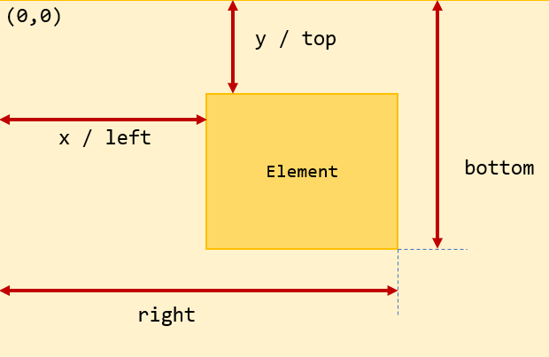

## Pozicování
Vše se pozicuje od levého horního rohu viz obrázek.



*Pokud chceme umístit obrázek doprostřed okna, jaké bude mít souřadnice?*
<br></br>

Pro jednoduchost a časté využívaní si vytvoříme classu na načítání obrázku i s možnou transformací(škálování)
<details>
  <summary>Load_pic.py</summary>

  ```python
  import pygame
  
  def load_pic(picture, rescale=1):
    pic = pygame.image.load(picture)
    rect = pic.get_rect()
    rescale_width = int(rect[2] * rescale)
    rescale_height = int(rect[3] * rescale)
    pic = pygame.transform.scale(pic, (rescale_width, rescale_height))
    return pic, rescale_width, rescale_height
  ```
</details>
